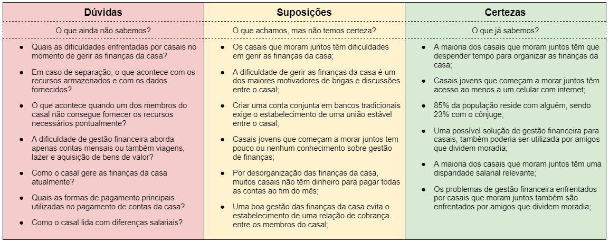
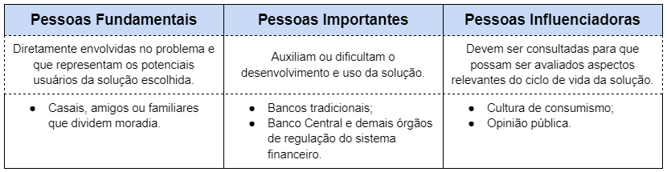
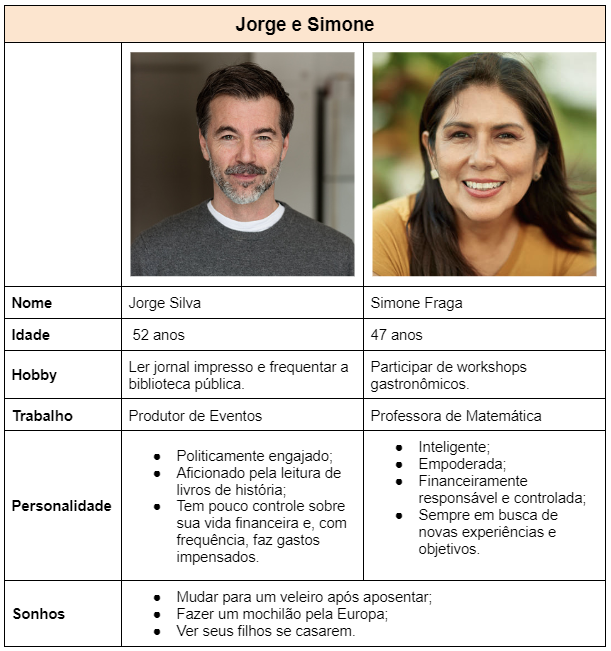
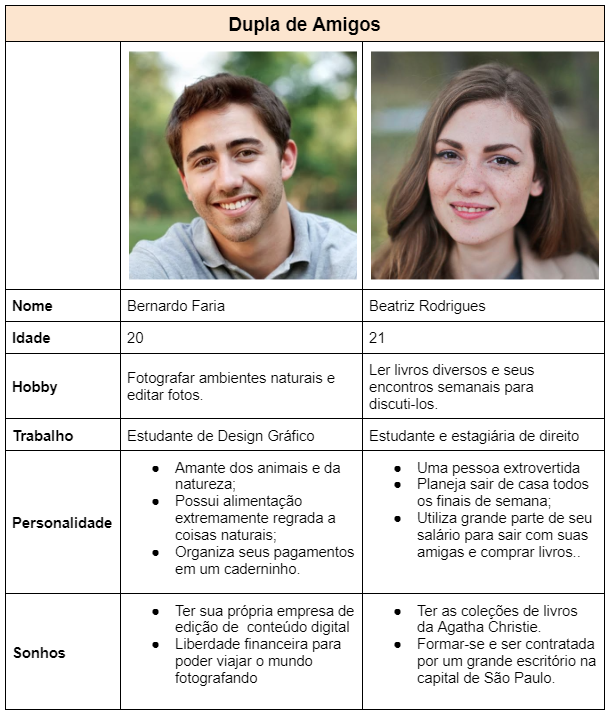

# Descrição do Problema
O tema designado para o projeto da nossa equipe foi “Problemas de gestão financeira”. Durante o processo inicial de Design Thinking, decidimos definir o escopo do nosso trabalho para “Problemas de gestão financeira enfrentados por casais que residem juntos”. O objetivo da dinâmica de Design Thinking foi tornar o problema escolhido cada vez mais específico e selecionar uma solução a ser desenvolvida em formato de aplicação web.

# Membros da Equipe
* João Victor Salim Ribeiro Guimarães
* Luca Ferrari Azalim
* Pedro Lucas Sousa e Silva
* Sidney Soares Santos Barbosa

# Matriz de Alinhamento CSD

# Mapa de Stakeholders

# Personas

Diante do objetivo de desenvolver uma solução de gestão financeira direcionada para casais ou duplas de amigos, criamos personas compostas por dois indivíduos.

# Brainstorm

# Mural de Possibilidades

# Mapa de Priorização