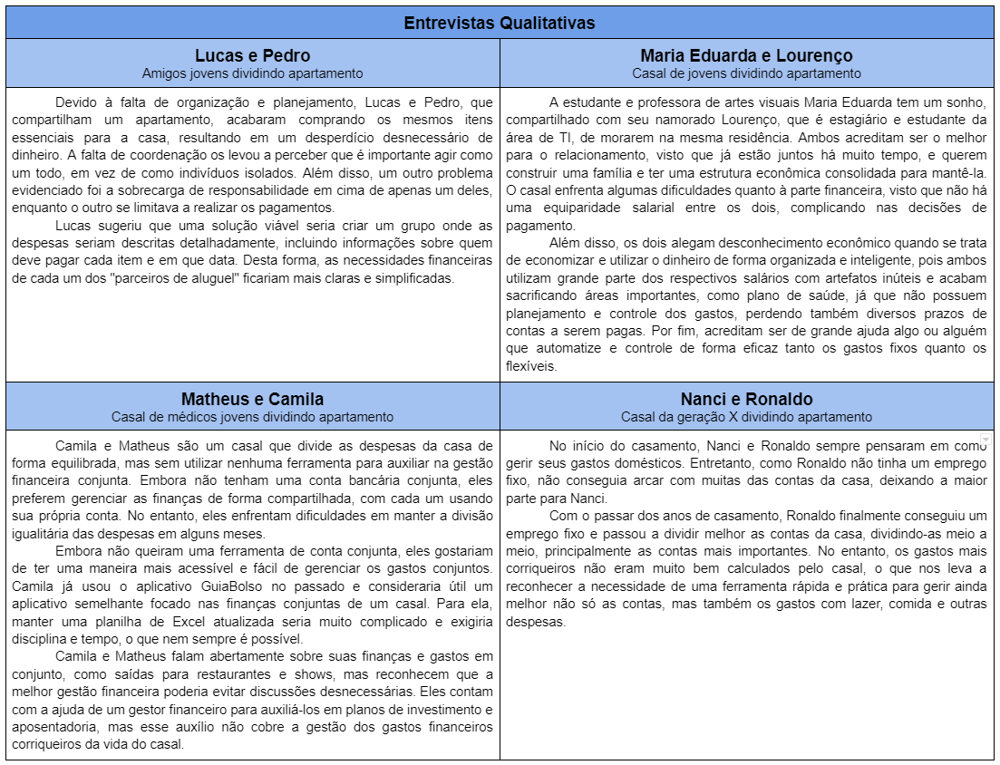

# Descrição do Problema
O tema designado para o projeto da nossa equipe foi “Problemas de gestão financeira”.

# Membros da Equipe
* João Victor Salim Ribeiro Guimarães
* Luca Ferrari Azalim
* Pedro Lucas Sousa e Silva
* Sidney Soares Santos Barbosa

# Matriz de Alinhamento CSD

# Mapa de Stakeholders

    

# Entrevistas Qualitativas

# Personas

Diante do objetivo de desenvolver uma solução de gestão financeira direcionada para casais ou duplas de amigos, criamos personas compostas por dois indivíduos.

# Mural de Possibilidades

# Mapa de Priorização

    

