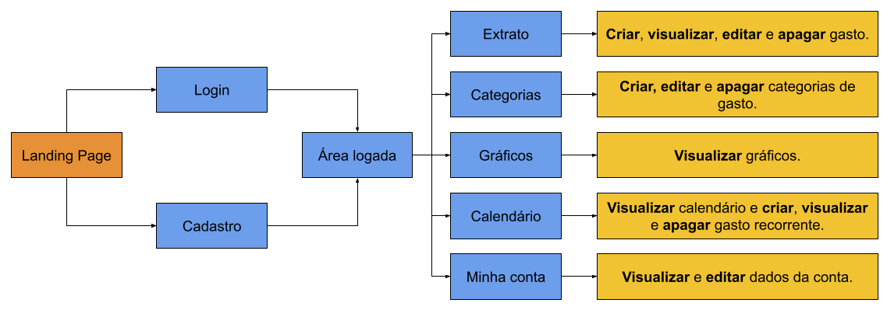

# Informações do Projeto
`Título do Projeto` **FinCouple:** Reinventando a Gestão Financeira Compartilhada

`Curso` Engenharia de Software

## Participantes

* João Victor Salim Ribeiro Guimarães
* Luca Ferrari Azalim
* Pedro Lucas Sousa e Silva
* Sidney Soares Santos Barbosa

# Estrutura do Documento

- [Informações do Projeto](#informações-do-projeto)
  - [Participantes](#participantes)
- [Estrutura do Documento](#estrutura-do-documento)
- [Introdução](#introdução)
  - [Problema](#problema)
  - [Objetivos](#objetivos)
  - [Justificativa](#justificativa)
  - [Público-Alvo](#público-alvo)
- [Especificações do Projeto](#especificações-do-projeto)
  - [Personas](#personas)
  - [Histórias de Usuários](#histórias-de-usuários)
  - [Requisitos](#requisitos)
    - [Requisitos Funcionais](#requisitos-funcionais)
    - [Requisitos não Funcionais](#requisitos-não-funcionais)
- [Projeto de Interface](#projeto-de-interface)
  - [User Flow](#user-flow)
  - [Wireframes](#wireframes)
- [Metodologia](#metodologia)
  - [Divisão de Papéis](#divisão-de-papéis)
  - [Ferramentas](#ferramentas)
  - [Controle de Versão](#controle-de-versão)
- [Projeto da Solução](#projeto-da-solução)
  - [Tecnologias Utilizadas](#tecnologias-utilizadas)
  - [Arquitetura da solução](#arquitetura-da-solução)
- [Avaliação da Aplicação](#avaliação-da-aplicação)
  - [Plano de Testes](#plano-de-testes)
  - [Ferramentas de Testes (Opcional)](#ferramentas-de-testes-opcional)
  - [Registros de Testes](#registros-de-testes)
- [Referências](#referências)

# Introdução

**FinCouple** é um projeto da disciplina “Trabalho Interdisciplinar: Aplicações Web“ do 1º período de Engenharia de Software da PUC Minas. O objetivo é desenvolver uma solução de gestão financeira facilitada, em formato de aplicação web front-end, para casais (ou duplas de amigos e familiares) que dividem a mesma moradia.

## Problema

Casais que residem juntos enfrentam uma dificuldade latente de gerir as finanças da casa e os gastos realizados de forma conjunta. A solução mais óbvia, que é a abertura de uma conta conjunta em um banco tradicional, é burocrática e pouco informatizada. Além disso, os bancos digitais em operação no país não oferecem a possibilidade de abertura de conta conjunta, o que impede uma gestão compartilhada das finanças do casal e obriga os indivíduos a gerirem os gastos compartilhados de maneira informal.

## Objetivos

Desenvolver uma aplicação que permita aos casais gerir as finanças da casa de forma compartilhada, intuitiva e facilitada. É importante encorajar os indivíduos do casal e conversarem sobre finanças de maneira aberta e descomplicada, transformando este assunto em apenas mais um que se conversa no dia a dia e não um que se quer evitar.

## Justificativa

Casais que residem juntos não podem continuar gerindo suas finanças de maneira artesanal e sem ajuda de uma ferramenta robusta, confiável, transparente e prática. Em muitos casos, a desorganização financeira acaba gerando brigas e discussões entre os indivíduos que residem juntos, o que afeta diretamente a qualidade do relacionamento. No mercado, há uma lacuna para uma solução que permita a gerir gastos de forma compartilhada.

## Público-Alvo

O público-alvo da solução a ser desenvolvida são casais, duplas de amigos ou duplas de familiares que residem juntos e dividem a administração das finanças da casa. Como foco, mas não como limitação, a  FinCouple tem a intenção de atingir pessoas jovens e com pouca experiência na gestão de finanças pessoais.
 
# Especificações do Projeto

O projeto será uma aplicação web front-end, desenvolvida utilizando as linguagens HTML, CSS e JavaScript. Como folha de estilo, será usado o framework Bootstrap 5.

## Personas

## Histórias de Usuários

Com base na análise das personas, foram identificadas as seguintes histórias de usuários:

## Requisitos

As informações que se seguem apresentam os requisitos funcionais e não funcionais que detalham o escopo do projeto.

### Requisitos Funcionais

1. **[#1](https://github.com/ICEI-PUC-Minas-PPLES-TI/plf-es-2023-1-ti1-0385200-fincouple/issues/1) Landing Page:** Criação de uma página estática contendo uma breve apresentação da solução e botões de Login e Cadastro.

2. **[#2](https://github.com/ICEI-PUC-Minas-PPLES-TI/plf-es-2023-1-ti1-0385200-fincouple/issues/2) Cadastro e Login:** O cadastro do casal na aplicação será realizado em um mesmo fluxo, em que são solicitadas tanto informações compartilhadas como informações individuais. Contudo, cada indivíduo do casal terá suas próprias informações de login e senha.

3. **[#3](https://github.com/ICEI-PUC-Minas-PPLES-TI/plf-es-2023-1-ti1-0385200-fincouple/issues/3) Área logada:** Após o login, o usuário verá a tela inicial da aplicação, que exibirá informações de cada indivíduo do casal, botões para acionamento das funcionalidades e extrato compartilhado de gastos.

4. **[#4](https://github.com/ICEI-PUC-Minas-PPLES-TI/plf-es-2023-1-ti1-0385200-fincouple/issues/4) Extrato:** A página de extrato deve permitir o registro de gastos e exibir os gastos já cadastrados.

5. **[#5](https://github.com/ICEI-PUC-Minas-PPLES-TI/plf-es-2023-1-ti1-0385200-fincouple/issues/5) Categorias:** Ao registrar um gasto do casal na aplicação, o usuário deverá definir uma categoria para aquele gasto. A aplicação terá categorias pré-definidas, mas também a possibilidade de criar categorias personalizadas.

6. **[#6](https://github.com/ICEI-PUC-Minas-PPLES-TI/plf-es-2023-1-ti1-0385200-fincouple/issues/6) Gráficos:** Criação de página estilo “summary” com as seguintes possibilidades de gráficos:
* Gasto total mensal;
* Gasto total por categoria;
* Gasto total por indivíduo do casal.

7. **[#7](https://github.com/ICEI-PUC-Minas-PPLES-TI/plf-es-2023-1-ti1-0385200-fincouple/issues/7) Calendário:** Criação da funcionalidade Calendário, que permitirá o cadastro de gastos recorrentes e exibirá um calendário e notificações com lembretes de pagamento.

8. **[#8](https://github.com/ICEI-PUC-Minas-PPLES-TI/plf-es-2023-1-ti1-0385200-fincouple/issues/8) Minha Conta:** Criação de uma página para que o usuário possa gerir informações individuais de sua conta, realizar alteração de senha e apagar o cadastro.

### Requisitos não Funcionais

1. O layout da aplicação deverá ser responsivo e adaptado a qualquer tamanho de dispositivo;

# Projeto de Interface

Como demonstrado no fluxo de usuário abaixo, cada requisito funcional dará origem a uma ou mais telas da aplicação.

## User Flow

## Wireframes

Os protótipos navegáveis podem ser acessados clicando [aqui](https://www.figma.com/proto/vUBvqTOmmNrf4tO5YCQ9Qv/landing-page?node-id=1-2&scaling=scale-down&page-id=0%3A1&starting-point-node-id=43%3A56).

# Metodologia

## Divisão de Papéis

Durante a fase de desenvolvimento, utilizaremos a ferramenta **Projetos** da plataforma **GitHub** para organizar e distribuir as tarefas, que serão divididas em quatro estados (colunas):

* **To Do:** tarefas ainda não iniciadas, mas que já foram criadas e documentadas na ferramenta;
* **Em Progresso:** tarefas que estão ativamente sendo trabalhadas por algum dos membros da equipe;
* **Pronto:** tarefas que foram finalizadas, mas que ainda dependem de revisão dos demais membros da equipe;
* **Revisadas:** tarefas revisadas por todos os membros da equipe e, portanto, totalmente funcionais e concluídas.

As tarefas da fase de desenvolvimento foram distribuídas aos membros da equipe e podem ser acessadas clicando [aqui](https://github.com/orgs/ICEI-PUC-Minas-PPLES-TI/projects/165).

## Ferramentas

As ferramentas utilizadas durante o processo de concepção e desenvolvimento estão listadas abaixo.

| Finalidade                           | Plataforma                    | Link de Acesso                                                                                                                                                  |
| ------------------------------------ | ----------------------------- | --------------------------------------------------------------------------------------------------------------------------------------------------------------- |
| Processo de Design Thinking          | Google Docs e Google Drawings | [Diretório do Google Drive](https://drive.google.com/drive/u/0/folders/1EF158RlYOtuzogVonm-w23Om6kr79MBy)                                                       |
| Repositório de Código e Documentação | GitHub                        | [Repositório no GitHub](https://github.com/ICEI-PUC-Minas-PPLES-TI/plf-es-2023-1-ti1-0385200-fincouple)                                                         |
| Gerenciamento de Tarefas (KanBan)    | GitHub Projects               | [Projeto no GitHub](https://github.com/orgs/ICEI-PUC-Minas-PPLES-TI/projects/165)                                                                               |
| Protótipos Interativos               | Figma                         | [Projeto do Figma](https://www.figma.com/proto/vUBvqTOmmNrf4tO5YCQ9Qv/landing-page?node-id=1-2&scaling=scale-down&page-id=0%3A1&starting-point-node-id=43%3A56) |

## Controle de Versão

A estratégia de Controle de Versão será definida durante a fase de desenvolvimento.

---

# Projeto da Solução

......  COLOQUE AQUI O SEU TEXTO ......

## Tecnologias Utilizadas

......  COLOQUE AQUI O SEU TEXTO ......

> Descreva aqui qual(is) tecnologias você vai usar para resolver o seu
> problema, ou seja, implementar a sua solução. Liste todas as
> tecnologias envolvidas, linguagens a serem utilizadas, serviços web,
> frameworks, bibliotecas, IDEs de desenvolvimento, e ferramentas.
> Apresente também uma figura explicando como as tecnologias estão
> relacionadas ou como uma interação do usuário com o sistema vai ser
> conduzida, por onde ela passa até retornar uma resposta ao usuário.
> 
> Inclua os diagramas de User Flow, esboços criados pelo grupo
> (stoyboards), além dos protótipos de telas (wireframes). Descreva cada
> item textualmente comentando e complementando o que está apresentado
> nas imagens.

## Arquitetura da solução

......  COLOQUE AQUI O SEU TEXTO E O DIAGRAMA DE ARQUITETURA .......

> Inclua um diagrama da solução e descreva os módulos e as tecnologias
> que fazem parte da solução. Discorra sobre o diagrama.
> 
> **Exemplo do diagrama de Arquitetura**:
> 
> 

# Avaliação da Aplicação

......  COLOQUE AQUI O SEU TEXTO ......

> Apresente os cenários de testes utilizados na realização dos testes da
> sua aplicação. Escolha cenários de testes que demonstrem os requisitos
> sendo satisfeitos.

## Plano de Testes

......  COLOQUE AQUI O SEU TEXTO ......

> Enumere quais cenários de testes foram selecionados para teste. Neste
> tópico o grupo deve detalhar quais funcionalidades avaliadas, o grupo
> de usuários que foi escolhido para participar do teste e as
> ferramentas utilizadas.
> 
> **Links Úteis**:
> * [IBM * Criação e Geração de Planos de Teste](https://www.ibm.com/developerworks/br/local/rational/criacao_geracao_planos_testes_software/index.html)
> * [Práticas e Técnicas de Testes Ágeis](http://assiste.serpro.gov.br/serproagil/Apresenta/slides.pdf)
> *  [Teste de Software: Conceitos e tipos de testes](https://blog.onedaytesting.com.br/teste-de-software/)

## Ferramentas de Testes (Opcional)

......  COLOQUE AQUI O SEU TEXTO ......

> Comente sobre as ferramentas de testes utilizadas.
> 
> **Links Úteis**:
> * [Ferramentas de Test para Java Script](https://geekflare.com/javascript-unit-testing/)
> * [UX Tools](https://uxdesign.cc/ux-user-research-and-user-testing-tools-2d339d379dc7)

## Registros de Testes

......  COLOQUE AQUI O SEU TEXTO ......

> Discorra sobre os resultados do teste. Ressaltando pontos fortes e
> fracos identificados na solução. Comente como o grupo pretende atacar
> esses pontos nas próximas iterações. Apresente as falhas detectadas e
> as melhorias geradas a partir dos resultados obtidos nos testes.

# Referências

......  COLOQUE AQUI O SEU TEXTO ......

> Inclua todas as referências (livros, artigos, sites, etc) utilizados
> no desenvolvimento do trabalho.
> 
> **Links Úteis**:
> * [Formato ABNT](https://www.normastecnicas.com/abnt/trabalhos-academicos/referencias/)
> * [Referências Bibliográficas da ABNT](https://comunidade.rockcontent.com/referencia-bibliografica-abnt/)