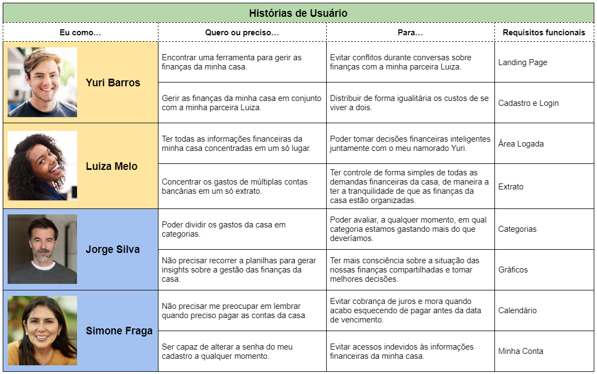

# Informações do Projeto
`Título do Projeto` **FinCouple:** Reinventando a Gestão Financeira Compartilhada

`Curso` Engenharia de Software

## Participantes

* João Victor Salim Ribeiro Guimarães
* Luca Ferrari Azalim
* Pedro Lucas Sousa e Silva
* Sidney Soares Santos Barbosa

# Estrutura do Documento

- [Informações do Projeto](#informações-do-projeto)
  - [Participantes](#participantes)
- [Estrutura do Documento](#estrutura-do-documento)
- [Introdução](#introdução)
  - [Problema](#problema)
  - [Objetivos](#objetivos)
  - [Justificativa](#justificativa)
  - [Público-Alvo](#público-alvo)
- [Especificações do Projeto](#especificações-do-projeto)
  - [Personas](#personas)
  - [Histórias de Usuários](#histórias-de-usuários)
  - [Requisitos](#requisitos)
    - [Requisitos Funcionais](#requisitos-funcionais)
    - [Requisitos não Funcionais](#requisitos-não-funcionais)
    - [Restrições](#restrições)
- [Projeto de Interface](#projeto-de-interface)
  - [User Flow](#user-flow)
  - [Wireframes](#wireframes)
- [Metodologia](#metodologia)
  - [Divisão de Papéis](#divisão-de-papéis)
  - [Ferramentas](#ferramentas)
  - [Controle de Versão](#controle-de-versão)
- [Projeto da Solução](#projeto-da-solução)
  - [Tecnologias Utilizadas](#tecnologias-utilizadas)
  - [Arquitetura da solução](#arquitetura-da-solução)
- [Referências](#referências)

# Introdução

**FinCouple** é um projeto da disciplina “Trabalho Interdisciplinar: Aplicações Web“ do 1º período de Engenharia de Software da PUC Minas. O objetivo é desenvolver uma solução de gestão financeira facilitada, em formato de aplicação web front-end, para casais (ou duplas de amigos e familiares) que dividem a mesma moradia.

## Problema

Casais que residem juntos enfrentam uma dificuldade latente de gerir as finanças da casa e os gastos realizados de forma conjunta. A solução mais óbvia, que é a abertura de uma conta conjunta em um banco tradicional, é burocrática e pouco informatizada. Além disso, os bancos digitais em operação no país não oferecem a possibilidade de abertura de conta conjunta, o que impede uma gestão compartilhada das finanças do casal e obriga os indivíduos a gerirem os gastos compartilhados de maneira informal.

## Objetivos

Desenvolver uma aplicação que permita aos casais gerir as finanças da casa de forma compartilhada, intuitiva e facilitada. É importante encorajar os indivíduos do casal e conversarem sobre finanças de maneira aberta e descomplicada, transformando este assunto em apenas mais um que se conversa no dia a dia e não um que se quer evitar.

## Justificativa

Casais que residem juntos não podem continuar gerindo suas finanças de maneira artesanal e sem ajuda de uma ferramenta robusta, confiável, transparente e prática. Em muitos casos, a desorganização financeira acaba gerando brigas e discussões entre os indivíduos que residem juntos, o que afeta diretamente a qualidade do relacionamento. No mercado, há uma lacuna para uma solução que permita a gerir gastos de forma compartilhada.

## Público-Alvo

O público-alvo da solução a ser desenvolvida são casais, duplas de amigos ou duplas de familiares que residem juntos e dividem a administração das finanças da casa. Como foco, mas não como limitação, a  FinCouple tem a intenção de atingir pessoas jovens e com pouca experiência na gestão de finanças pessoais.
 
# Especificações do Projeto

O projeto será uma aplicação web front-end, desenvolvida utilizando as linguagens HTML, CSS e JavaScript. Como folha de estilo, será usado o framework Bootstrap 5.

## Personas

Durante o processo de Design Thinking, foram elaboradas personas em forma de casais, como demonstrado abaixo:

## Histórias de Usuários

Com base na análise das personas, foram elaboradas as seguintes histórias de usuários:

## Requisitos

As informações que se seguem apresentam os requisitos funcionais e não funcionais que detalham o escopo do projeto.

### Requisitos Funcionais

Cada requisito funcional possui seu issue com documentações mais detalhadas e completas.

1. **[#1](https://github.com/ICEI-PUC-Minas-PPLES-TI/plf-es-2023-1-ti1-0385200-fincouple/issues/1) Landing Page:** página estática contendo uma breve apresentação da solução e links para as páginas de Cadastro e Login.

2. **[#2](https://github.com/ICEI-PUC-Minas-PPLES-TI/plf-es-2023-1-ti1-0385200-fincouple/issues/2) Cadastro e Login:** o cadastro do casal na aplicação será realizado em um mesmo fluxo, em que serão solicitadas tanto informações compartilhadas como informações individuais. Cada indivíduo do casal terá suas próprias informações de login e senha.

3. **[#3](https://github.com/ICEI-PUC-Minas-PPLES-TI/plf-es-2023-1-ti1-0385200-fincouple/issues/3) Área logada:** quando logado, o usuário verá a tela inicial da aplicação, que exibirá informações de cada indivíduo do casal e links para as demais páginas e funcionalidades da aplicação.

4. **[#4](https://github.com/ICEI-PUC-Minas-PPLES-TI/plf-es-2023-1-ti1-0385200-fincouple/issues/4) Extrato:** a página de extrato permitirá visualizar todos os gastos cadastrados, assim como cadastrar novos gastos e editar e apagar gastos já cadastrados. A listagem de gastos deve exibir os atributos mais importantes de cada gasto, como identificação, valor e categoria.

5. **[#5](https://github.com/ICEI-PUC-Minas-PPLES-TI/plf-es-2023-1-ti1-0385200-fincouple/issues/5) Categorias:** ao registrar um gasto do casal na aplicação, o usuário deverá definir uma categoria para aquele gasto. Por meio da página Categorias, será possível visualizar as categorias cadastradas, criar categorias personalizadas e editar e apagar categorias já existentes.

6. **[#6](https://github.com/ICEI-PUC-Minas-PPLES-TI/plf-es-2023-1-ti1-0385200-fincouple/issues/6) Gráficos:** página estilo “summary” repleta de gráficos que permitam uma rápida compreensão da situação das finanças do casal.

7. **[#7](https://github.com/ICEI-PUC-Minas-PPLES-TI/plf-es-2023-1-ti1-0385200-fincouple/issues/7) Calendário:** a funcionalidade de Calendário permitirá cadastrar gastos recorrentes e pontuais para receber lembretes de quando eles devem ser pagos. A página inicial da funcionalidade exibirá um calendário contendo as próximas contas a serem pagas.

8. **[#8](https://github.com/ICEI-PUC-Minas-PPLES-TI/plf-es-2023-1-ti1-0385200-fincouple/issues/8) Minha Conta:** criação de uma página para que o usuário possa gerir informações individuais de sua conta, realizar alteração de senha e apagar o cadastro.

9. **[#9](https://github.com/ICEI-PUC-Minas-PPLES-TI/plf-es-2023-1-ti1-0385200-fincouple/issues/9) Calculadoras:** página que reúne diversos tipos de calculadoras financeiras para uso no dia a dia.

### Requisitos não Funcionais

1. O layout da aplicação deverá ser responsivo e adaptado a qualquer tamanho de dispositivo.

### Restrições

1. A aplicação será disponibilizada apenas via web;
2. A aplicação deve utilizar exclusivamente recursos de front-end;
3. O desenvolvimento da aplicação deve ser finalizado até o final do semestre.

# Projeto de Interface

Como demonstrado no fluxo de usuário abaixo, cada requisito funcional dará origem a uma ou mais telas da aplicação.

## User Flow

## Wireframes

Os protótipos navegáveis atualizados podem ser acessados clicando [aqui](https://www.figma.com/proto/vUBvqTOmmNrf4tO5YCQ9Qv/landing-page?node-id=1-2&scaling=scale-down&page-id=0%3A1&starting-point-node-id=43%3A56).

# Metodologia

Utilizamos o processo de [*Design Thinking*](docs/concepcao/README.md), que, além do preenchimento de diversos canvases, contemplou a realização de sessões de *Brainstorm* para posterior definição de qual seria a solução trabalhada. Após a definição da solução, foram elaborados oito requisitos funcionais, que foram documentados em *Issues* e incluídos em nosso no Projeto do GitHub, exibido em formato de Kanban. Por fim, foram distribuídos dois requisitos funcionais para cada membro da equipe.

## Divisão de Papéis

Durante a fase de desenvolvimento, utilizaremos a ferramenta **Projetos** da plataforma **GitHub** para organizar e distribuir as tarefas, que serão divididas em quatro estados (colunas):

* **To Do:** tarefas ainda não iniciadas, mas que já foram criadas e documentadas na ferramenta;
* **Em Progresso:** tarefas que estão ativamente sendo trabalhadas por algum dos membros da equipe;
* **Pronto:** tarefas que foram finalizadas, mas que ainda dependem de revisão dos demais membros da equipe;
* **Revisadas:** tarefas revisadas por todos os membros da equipe e, portanto, totalmente funcionais e concluídas.

As tarefas da fase de desenvolvimento foram distribuídas aos membros da equipe e podem ser acessadas clicando [aqui](https://github.com/orgs/ICEI-PUC-Minas-PPLES-TI/projects/165).

## Ferramentas

As ferramentas utilizadas durante o processo de concepção e desenvolvimento estão listadas abaixo.

| Finalidade                           | Plataforma                    | Link de Acesso                                                                                                                                                  |
| ------------------------------------ | ----------------------------- | --------------------------------------------------------------------------------------------------------------------------------------------------------------- |
| Repositório de Código e Documentação | GitHub                        | [Repositório no GitHub](https://github.com/ICEI-PUC-Minas-PPLES-TI/plf-es-2023-1-ti1-0385200-fincouple)                                                         |
| Gerenciamento de Tarefas (Kanban)    | GitHub Projects               | [Projeto no GitHub](https://github.com/orgs/ICEI-PUC-Minas-PPLES-TI/projects/165)                                                                               |
| Processo de Design Thinking          | Google Docs e Google Drawings | [Diretório do Google Drive](https://drive.google.com/drive/u/0/folders/1EF158RlYOtuzogVonm-w23Om6kr79MBy)                                                       |
| Protótipos Interativos               | Figma                         | [Projeto do Figma](https://www.figma.com/proto/vUBvqTOmmNrf4tO5YCQ9Qv/landing-page?node-id=1-2&scaling=scale-down&page-id=0%3A1&starting-point-node-id=43%3A56) |

## Controle de Versão

A estratégia de Controle de Versão será definida durante a fase de desenvolvimento.

---

# Projeto da Solução

Aplicação web front-end para gestão financeira de casais, duplas de amigos e duplas de familiares que residam juntos e dividam a administração das finanças da casa.

## Tecnologias Utilizadas
- HTML, CSS e JavaScript
- Bootstrap 5
- jQuery 3.6.4
- FontAwesome 6.4.0
- SASS (Para customização do Bootstrap)
- NPM (Gerenciador de Pacotes)

## Arquitetura da solução
- Páginas web (HTML, CSS e JavaScript)
- LocalStorage para armazenamento de dados

# Referências
